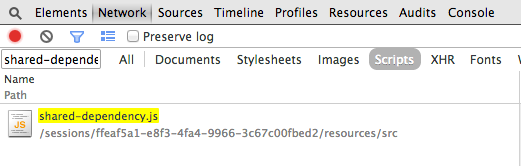
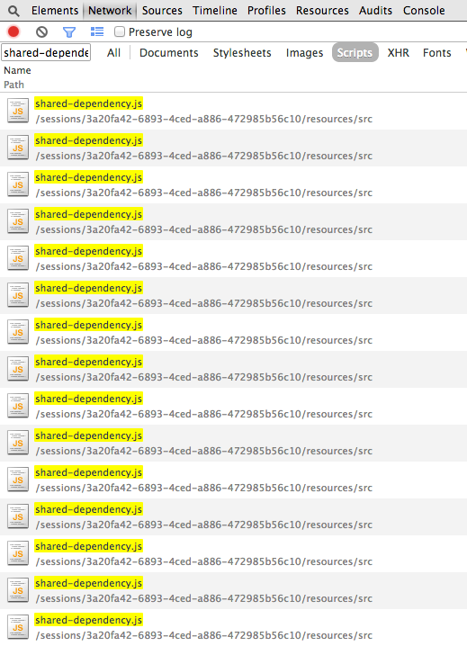
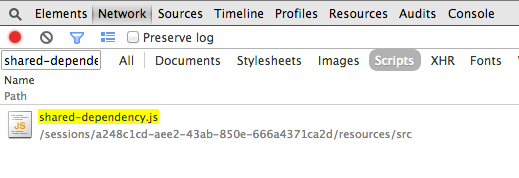

# Stubbing in RequireJS projects

This repository is really just an experiment to show how different stubbing libraries for RequireJS perform.

Specifically, it's interesting to observe how many times dependencies are (re-)loaded with different stubbing solutions, as that can greatly impact performance in projects with a large codebase and many dependencies to resolve.

In my use case and on my computer (YMMV), I observed a ~350ms cost being added to the four tests that used Squire. This is only a second you might argue ... but if extrapolated to all the tests in my project, the runtime of the entire test suite would grow by more than an hour. This caused me to start looking at alternative solutions, and I ended up writing [bogus](https://github.com/mroderick/bogus) to scratch that itch.

## Setup

Before you can run the experiments, we need to set up all the dependencies

```
$ npm install
```

## Running the tests


To run the tests, you need to use [BusterJS](http://busterjs.org)

### Start the BusterJS server and capture a browser

```
# start the buster server
$ $(npm bin)/buster-server

```

Then capture a browser with <http://localhost:1111/capture>

### Run all the tests


In a new tab/process in your CLI (so the buster server keeps running).

```
# run the tests
$ $(npm bin)/buster-test
```

You should see something like

```
$ buster-test
45 tests, 45 assertions, 1 runtime ... OK
45 tests, 45 assertions, 1 runtime ... OK
45 tests, 45 assertions, 1 runtime ... OK
```

### Run individual tests

```
# run the test group without any stubbing library
$ $(npm bin)/buster-test -g no-stubs

# run the test group for the squire library
$ $(npm bin)/buster-test -g squire

# run the test group for the bogus library
$ $(npm bin)/buster-test -g bogus

```

## Observing the reloads

I used Google Chrome, opened Developer Tools and in the Network tab, filtered by scripts and "shared-dependency.js".

### No stubs

`shared-dependency.js` is loaded once



### Squire

`shared-dependency.js` is loaded 15 times, once per file that references it



### bogus

`shared-dependency.js` is loaded once.

If we were to write tests for `shared-dependency.js`, it would be loaded twice.



## License

MIT: http://mrgnrdrck.mit-license.org
